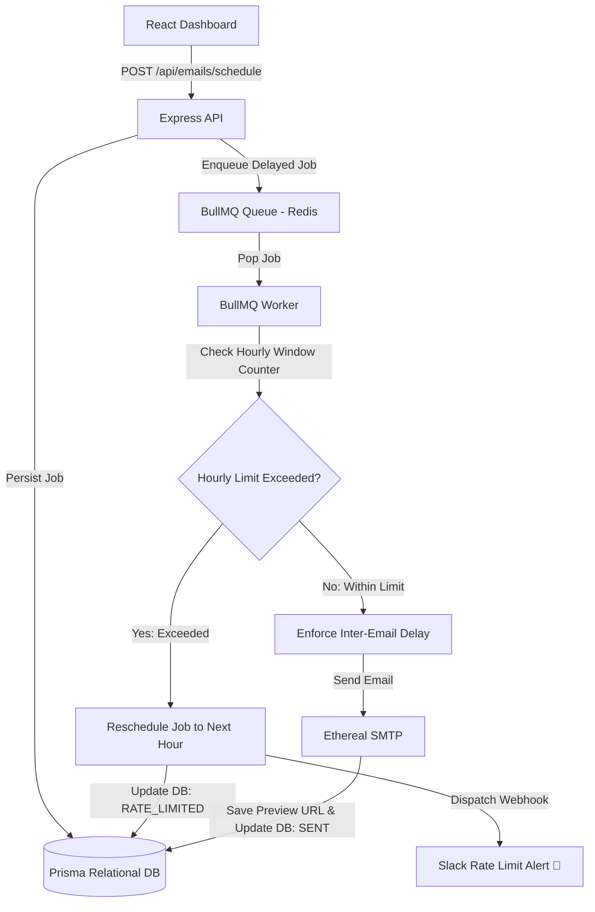

# 🚀 ReachInbox - Full-Stack Email Job Scheduler & Dashboard

Pixel-perfect implementation matching the provided **Figma design** (1440x900 desktop reference resolution and responsive) with a robust, persistent backend powered by **Express.js**, **BullMQ + Redis**, **Prisma ORM**, **Ethereal fake SMTP**, and **Slack Rate-Limit Notifications**.

---

## 🌟 Key Features

### 🎨 Frontend (React + TypeScript + Tailwind CSS)
- **Pixel-Accurate Figma Fidelity**: Exact replication of the Login screen, Scheduled Emails list, Sent Emails list, Compose New Email modal, and Send Later popovers.
- **Real Google OAuth & Demo Auth**: Seamless authentication with user avatar, name, and email state persistence.
- **Lead List CSV / Text Parsing**: Drag & drop or paste CSV/TXT lead files with instant regex email extraction, count detection badge, and removable pill tags (`tame@jmail.com`, `lame@jmail.com`, etc.).
- **Dynamic Scheduling Controls**: Configure sender, start date & time, inter-email delay (seconds), and hourly rate limits per campaign.
- **Rich Text Toolbar**: Full formatting toolbar (Undo, Redo, Typography size, Bold, Italic, Underline, Alignment, Lists, Indents, Quotes, Strikethrough, Link).
- **Live Search & Queue Visibility**: Real-time BullMQ queue status indicator and search filtering across scheduled and sent emails.
- **Ethereal Email Web Viewer**: Instant one-click access to open Ethereal Email browser preview URLs for sent emails.
- **Slack Alert Modal**: Direct interface to connect and test live Slack rate-limit webhook notifications.

### ⚙️ Backend (Express + TypeScript + BullMQ + Redis + Prisma)
- **BullMQ + Redis Delayed Job Scheduling**: Persistent queue without OS-level or Node cron jobs.
- **Server Restart Persistence (Zero Job Loss)**: All scheduled and rate-limited jobs are tracked in the database and automatically re-synchronized with BullMQ on server startup.
- **Configurable Worker Concurrency**: Multi-worker parallelism configurable via environment variables (`WORKER_CONCURRENCY`).
- **Inter-Email Throttling Delay**: Configurable minimum delay (e.g. 2 seconds) between email dispatches to mimic provider throttling.
- **Sliding-Window Hourly Rate Limiting**: Enforced per-sender via Redis/database counters (`MAX_EMAILS_PER_HOUR_PER_SENDER`).
- **Graceful Job Rescheduling**: Overflow jobs exceeding the hourly limit are never dropped—they are automatically postponed to the next available hour window.
- **Live Slack Alert on Rate-Limit Hit**: Real-time webhook dispatch with rich Slack formatting the moment a sender reaches their hourly rate limit.
- **Fake SMTP via Ethereal Email**: Automatic test account provisioning with verifiable message previews.

---

## 🏗️ Architecture Overview



---

## 📁 Repository Structure

```
ReachInbox/
├── backend/
│   ├── prisma/
│   │   ├── schema.prisma         # Prisma Schema (User, EmailJob, RateLimitLog)
│   │   └── seed.ts               # Database demo seed script
│   ├── src/
│   │   ├── config/index.ts       # Central environment & app configuration
│   │   ├── controllers/          # Auth, Email, and Slack controllers
│   │   ├── lib/                  # Prisma client & Redis connection manager (with mock fallback)
│   │   ├── middlewares/          # JWT authentication middleware
│   │   ├── routes/               # Express API routes (/api/auth, /api/emails, /api/slack)
│   │   ├── services/             # SmtpService, QueueService, SlackService
│   │   ├── workers/              # BullMQ Email Worker with concurrency & rate limiting
│   │   └── server.ts             # Express server bootstrap & recovery lifecycle
│   ├── package.json
│   └── tsconfig.json
├── frontend/
│   ├── src/
│   │   ├── components/
│   │   │   ├── email/            # EmailRow, ComposeEmail, SendLaterModal, CsvUploader, SlackModal, etc.
│   │   │   ├── icons/            # Figma SVG icons (ONB Logo, Google Icon, etc.)
│   │   │   ├── layout/           # Sidebar & Header components
│   │   │   └── ui/               # Reusable UI primitives (Buttons, Badges, etc.)
│   │   ├── context/              # AuthContext & ToastContext
│   │   ├── pages/                # Login & Dashboard pages
│   │   ├── services/             # Axios API services (auth, email, slack)
│   │   ├── types/                # TypeScript interface definitions
│   │   ├── App.tsx
│   │   ├── index.css             # Tailwind styling & resets
│   │   └── main.tsx
│   ├── package.json
│   ├── tailwind.config.js
│   └── vite.config.ts
├── leads_sample.csv              # Sample CSV leads for testing
├── package.json                  # Root runner for concurrently
└── README.md
```

---

## ⚡ Quick Start Guide

### Prerequisites
- **Node.js**: v18.0.0 or higher (v20+ recommended)
- **npm** or **yarn**
- **Redis** (Optional: the backend automatically uses an in-memory Redis fallback if a local Redis server is not running)

---

### 1️⃣ Installation

Clone the repository and install all dependencies in one command:

```bash
git clone https://github.com/nilanshukumarsingh/ReachInbox.git
cd ReachInbox

# Install root, backend, and frontend dependencies
npm run install:all
```

---

### 2️⃣ Database Setup & Seed

Initialize the database schema and seed it with Figma demo data:

```bash
npm run db:push
npm run seed
```

---

### 3️⃣ Run the Full-Stack Application

Launch both the Express backend and Vite frontend simultaneously:

```bash
npm run dev
```

- **Frontend**: [http://localhost:5173](http://localhost:5173)
- **Backend API**: [http://localhost:5000](http://localhost:5000)
- **Health Check**: [http://localhost:5000/api/health](http://localhost:5000/api/health)

---

## 🔧 Environment Variables

### Backend Configuration (`backend/.env`)

```env
PORT=5000
DATABASE_URL="file:./dev.db"
REDIS_URL="redis://localhost:6379"
JWT_SECRET="reachinbox_jwt_secret_token_key_2026"
WORKER_CONCURRENCY=5
MIN_DELAY_SECONDS=2
DEFAULT_HOURLY_LIMIT=100
SLACK_WEBHOOK_URL="https://hooks.slack.com/services/YOUR/SLACK/WEBHOOK"
FRONTEND_URL="http://localhost:5173"
```

---

## 🧪 Verifying Assignment Scenarios

### 1. Persistent Scheduling Across Server Restarts
1. Open the dashboard and click **Compose**.
2. Upload `leads_sample.csv` or enter email leads.
3. Click the **Clock icon** (Send Later) and set a scheduled time 5 minutes in the future.
4. Click **Schedule**.
5. Stop the backend server in your terminal (`Ctrl + C`).
6. Restart the backend (`npm run dev:backend`).
7. **Result**: The server logs will display:
   ```
   🔄 [Persistence Recovery] Found pending email jobs. Re-enqueuing into BullMQ...
   ✅ [Persistence Recovery] All pending jobs successfully synchronized with BullMQ.
   ```
   Jobs execute at the exact scheduled time without duplicates.

### 2. Hourly Rate Limiting & Slack Notification
1. Open the **Slack** modal from the sidebar and input your Slack Incoming Webhook URL.
2. Schedule a batch of emails with an **Hourly Limit of 2**.
3. As soon as the 3rd email is processed:
   - The job is automatically rescheduled for the next hour window.
   - Database status updates to `RATE_LIMITED`.
   - A real formatted notification is dispatched to your Slack channel:
     ```
     🚨 Sender Hourly Rate Limit Reached
     Sender: oliver.brown@domain.io
     Hourly Limit: 2 emails/hr
     Status: Rescheduled to next hour window
     ```

### 3. Fake SMTP with Ethereal Email
- Every dispatched email is sent via Ethereal Email test accounts.
- In the **Sent** tab, click on any sent email or click the external link icon to view the real rendered email in your web browser.

---

## 📡 API Endpoints Reference

| Method | Endpoint | Description |
|---|---|---|
| `POST` | `/api/auth/login` | Standard/Demo login |
| `POST` | `/api/auth/google` | Google OAuth token verification |
| `GET` | `/api/auth/me` | Current authenticated user profile |
| `POST` | `/api/emails/schedule` | Batch schedule emails with delay & rate limits |
| `GET` | `/api/emails/scheduled` | List scheduled/delayed emails with search |
| `GET` | `/api/emails/sent` | List sent emails with preview URLs |
| `POST` | `/api/emails/star/:id` | Toggle email starred flag |
| `DELETE` | `/api/emails/:id` | Cancel/delete email job |
| `GET` | `/api/emails/stats` | Real-time BullMQ queue stats and database counts |
| `POST` | `/api/emails/parse-csv` | Parse lead files server-side |
| `POST` | `/api/slack/connect` | Connect Slack webhook URL |
| `POST` | `/api/slack/test` | Trigger live test alert to Slack |
| `POST` | `/api/slack/disconnect` | Disconnect Slack webhook |

---

## 👥 Authors & Reviewers
- **Candidate**: Nilanshu Kumar Singh
- **Repository**: [https://github.com/nilanshukumarsingh/ReachInbox](https://github.com/nilanshukumarsingh/ReachInbox)
- **Reviewers**: Mitrajit, Yadav036
